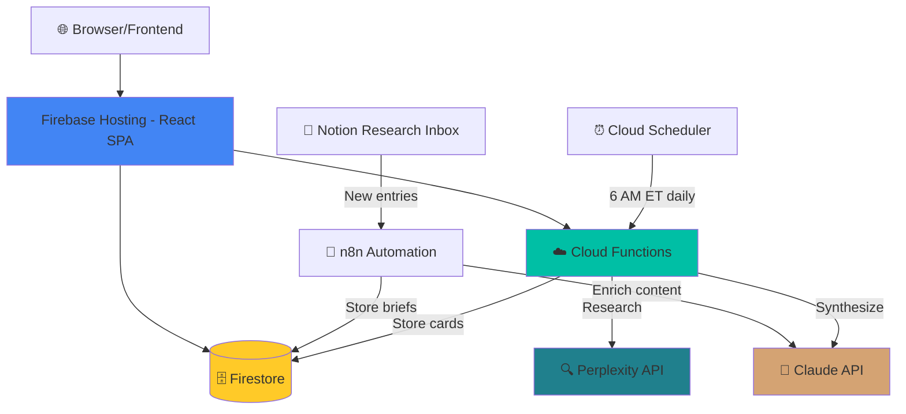

# PlannerAPI - Strategic Intelligence Platform

> 🚧 **Alpha - Active Development** | AI-powered daily intelligence for CMOs, VP Marketing, Brand Directors, and Growth Leaders

[](LICENSE)
[](https://firebase.google.com/)
[](https://www.typescriptlang.org/)
[](https://react.dev/)
[](https://github.com/nycsav/PlannerAPI)

[🚀 Live Demo](https://plannerapi-prod.web.app) | [📚 Documentation](docs/) | [🏗️ Architecture](ARCHITECTURE.md) | [🤝 Contributing](CONTRIBUTING.md)

---

## 🎯 What is PlannerAPI?

PlannerAPI surfaces **daily strategic intelligence** across four critical pillars for C-suite marketing leaders:

- **🟣 AI Strategy** - CMO adoption, AI operating models, enterprise tool evaluation, governance
- **🔵 Brand Performance** - Attribution models, campaign ROI, creative effectiveness, brand equity
- **🟠 Competitive Intel** - Market share shifts, agency moves, holding company strategy
- **🟢 Media Trends** - Platform changes, retail media, CTV, programmatic innovation

Every day at 6 AM ET, the platform automatically generates 10 intelligence cards synthesizing research from Perplexity AI and refined with Claude's analytical capabilities.

### ✅ Completed Features

- **📊 Premium Intelligence Library** - Tier 1-3 research from McKinsey, Gartner, Google, Anthropic
- **🔄 Notion Automation** - Research Inbox → Claude API → Firestore pipeline
- **🤖 Daily Intelligence Cards** - Auto-generated at 6 AM ET via Cloud Scheduler
- **🔍 Real-Time Search** - Powered by Perplexity AI for instant research
- **💬 Strategy Chat** - Conversational intelligence briefings with context
- **📈 Follow-Up Questions** - AI-powered "Ask Follow-Up" in intelligence modals
- **🔐 Authentication** - Google OAuth and email/password signup
- **📱 Responsive Design** - Mobile-first with accessibility standards
- **💰 Cost Optimization** - Prompt caching reduces API costs by 95%+

### 🚧 In Development

- **🎨 Bloomberg Terminal Design System** - Professional financial UI/UX
- **📧 Email Newsletter Delivery** - Automated weekly intelligence digest
- **🔎 Advanced Search & Filtering** - Multi-pillar, source tier, and date range filtering
- **📊 Analytics Dashboard** - User engagement metrics and content performance

### 💡 Planned Features

- **🔗 LinkedIn Publishing Automation** - n8n workflow → Claude → LinkedIn with backlinks
- **🤝 CRM Integration** - Sync intelligence briefs with HubSpot/Salesforce
- **👥 Team Workspaces** - Shared intelligence feeds for marketing teams
- **📚 Playbook Library** - Downloadable strategic frameworks (AEO/GEO, AI Workflows, etc.)
- **🎯 Personalized Feeds** - AI-curated content based on user role and interests

---

## 🏗️ Architecture

### Tech Stack

**Frontend:**
- React 19 with TypeScript
- Tailwind CSS for styling
- Firebase Hosting for deployment
- Vite build system

**Backend:**
- Firebase Cloud Functions (Node.js 20)
- Firestore (NoSQL database)
- Cloud Scheduler (automated triggers)

**APIs:**
- Perplexity AI (`sonar-pro` model) - Real-time research
- Anthropic Claude (`claude-sonnet-4-20250514`) - Content generation with prompt caching

**Analytics:**
- Google Analytics 4 (GA4)
- Custom Firestore event tracking

### System Diagram



**Key Data Flow:**
1. **Notion Research Inbox** → Tier 1-3 sources (McKinsey, Gartner, Google)
2. **n8n Workflow** → Triggers on new Notion entries
3. **Claude API** → Enriches with summary/signals/moves
4. **Firestore** → Stores as `premium_briefs` collection
5. **React Frontend** → Queries and displays intelligence
6. **Perplexity AI** → Enables follow-up questions in modals

---

## 🚀 Getting Started

### Prerequisites

- **Node.js** 20+
- **npm** 10+
- **Firebase CLI**: `npm install -g firebase-tools`
- **Perplexity API key** - Get at https://www.perplexity.ai/settings/api
- **Anthropic API key** - Get at https://console.anthropic.com/settings/keys
- **Firebase project** - Already configured for production

### Installation

1. **Clone the repository:**
   ```bash
   git clone https://github.com/nycsav/PlannerAPI.git
   cd PlannerAPI
   ```

2. **Install dependencies:**
   ```bash
   npm install
   cd functions && npm install && cd ..
   ```

3. **Configure environment variables:**
   ```bash
   cp .env.example .env
   # Edit .env with your Firebase credentials
   ```

4. **Set up Cloud Functions secrets:**
   ```bash
   firebase functions:config:set \
     pplx.api_key="YOUR_PERPLEXITY_KEY" \
     anthropic.api_key="YOUR_ANTHROPIC_KEY"
   ```

5. **Run development server:**
   ```bash
   npm run dev
   ```

   App available at: `http://localhost:5173`

---

## 📦 Deployment

### Frontend (Firebase Hosting)

```bash
npm run build
firebase deploy --only hosting
```

### Backend (Cloud Functions)

```bash
cd functions
npm run deploy
```

### Cloud Scheduler (Daily Cards)

Already configured to run at 6 AM ET. To verify:
```bash
gcloud scheduler jobs list --location=us-central1 --project=plannerapi-prod
```

For setup/troubleshooting, see: [`CLOUD-SCHEDULER-VERIFICATION.md`](CLOUD-SCHEDULER-VERIFICATION.md)

---

## 📚 Documentation

- **[API Endpoints](docs/API_ENDPOINTS.md)** - Backend endpoint reference with examples
- **[Deployment Guide](docs/DEPLOYMENT_CHECKLIST.md)** - Step-by-step deployment checklist
- **[Environment Setup](docs/ENVIRONMENT_SETUP.md)** - Configuration guide for all services
- **[Daily Intelligence Framework](docs/DAILY_INTEL_FRAMEWORK.md)** - Content architecture and editorial guidelines
- **[Editorial Voice](docs/EDITORIAL_VOICE.md)** - Writing guidelines and tone
- **[Analytics Architecture](docs/ANALYTICS_ARCHITECTURE.md)** - Tracking and metrics system
- **[Security: API Key Rotation](SECURITY-KEY-ROTATION.md)** - Key rotation procedures
- **[API Centralization](API-CENTRALIZATION-SUMMARY.md)** - Configuration management

---

## 🧪 Testing

### Manual Testing

See [TESTING-CHECKLIST.md](TESTING-CHECKLIST.md) for comprehensive feature tests including:
- Frontend components
- Backend endpoints
- Firebase integration
- Safari and mobile testing

### Backend Endpoint Testing

```bash
# Test trending topics
curl "https://planners-backend-865025512785.us-central1.run.app/trending/topics?audience=CMO&limit=6"

# Test chat intelligence
curl -X POST "https://planners-backend-865025512785.us-central1.run.app/chat-intel" \
  -H "Content-Type: application/json" \
  -d '{"query":"AI marketing strategy","audience":"CMO"}'
```

---

## 🔒 Security

- **API Keys**: Stored securely in Firebase Functions config (not in repository)
- **Environment Variables**: `.env` files excluded via `.gitignore`
- **Firestore Rules**: Fine-grained access control via `firestore.rules`
- **Authentication**: Firebase Auth with OAuth2 support
- **CORS**: Configured for production domain only

For key rotation procedures, see: [SECURITY-KEY-ROTATION.md](SECURITY-KEY-ROTATION.md)

---

## 📊 Project Structure

```
PlannerAPI/
├── src/
│   ├── config/
│   │   └── api.ts                 # Centralized API endpoints
│   ├── components/
│   │   ├── DailyIntelligence.tsx  # Intelligence feed
│   │   ├── IntelligenceModal.tsx  # Brief details
│   │   ├── HeroSearch.tsx         # Search interface
│   │   ├── ExecutiveStrategyChat.tsx
│   │   └── ... (40+ components)
│   ├── contexts/
│   │   ├── AuthContext.tsx        # Authentication
│   │   └── AudienceContext.tsx    # Audience selection
│   ├── hooks/
│   │   ├── useAnalytics.ts        # Analytics tracking
│   │   └── useDashboardData.ts
│   ├── utils/
│   │   ├── firebase.ts            # Firebase config
│   │   ├── perplexityClient.ts    # API client
│   │   └── validateEnv.ts         # Environment validation
│   └── App.tsx
├── functions/
│   └── src/
│       ├── generateDiscoverCards.ts  # Daily card generator
│       ├── chat-intel.ts             # Real-time intelligence
│       ├── chatSimple.ts             # Follow-up questions
│       └── types.ts                  # TypeScript definitions
├── docs/
│   ├── API_ENDPOINTS.md
│   ├── DEPLOYMENT_CHECKLIST.md
│   ├── DAILY_INTEL_FRAMEWORK.md
│   └── ... (more documentation)
├── components/
│   └── ErrorBoundary.tsx          # Error boundary for crash protection
├── firestore.rules                # Database security rules
├── firestore.indexes.json         # Database indexes
├── vite.config.ts                 # Build configuration
└── package.json
```

---

## 💰 Cost Optimization

**Monthly Estimate**: ~$2-5 total costs

- **Perplexity API**: ~$1-2 (research queries)
- **Anthropic Claude**: ~$0.31 (with prompt caching)
- **Firebase Functions**: ~$1
- **Cloud Run**: ~$1
- **Firebase Hosting**: Free tier
- **Firestore**: ~$0.5 (within free tier for normal usage)

**Cost-saving strategies:**
- Prompt caching reduces Claude costs by 95%
- Daily batch processing instead of real-time
- Firestore indexes optimize queries
- Static fallback cards reduce API calls

---

## 🤝 Contributing

Contributions welcome! See [CONTRIBUTING.md](CONTRIBUTING.md) for:
- Development workflow
- Code standards
- Commit message conventions
- Testing requirements
- Pull request process

---

## 📈 Roadmap

**Phase 2 (Upcoming):**
- Personalized homepage for logged-in users
- Weekly analytics digest emails
- LinkedIn publishing automation
- AI-powered weekly playbook generation

**Phase 3:**
- Multi-workspace support
- Custom intelligence categories
- Team collaboration features
- Advanced analytics dashboard

---

## 🐛 Troubleshooting

**Daily cards not generating?**
- Check Cloud Scheduler job: `gcloud scheduler jobs list --location=us-central1 --project=plannerapi-prod`
- View logs: `gcloud functions logs read generateDiscoverCards --region us-central1`
- See: [CLOUD-SCHEDULER-VERIFICATION.md](CLOUD-SCHEDULER-VERIFICATION.md)

**API calls timing out?**
- Check backend service health
- Verify Perplexity and Anthropic API keys are valid
- Increase timeout if needed (default: 30 seconds)

**Firestore permission errors?**
- Check security rules in Firebase Console
- Verify user is authenticated
- Check collection-level permissions

---

## 📝 License

MIT License - see [LICENSE](LICENSE) file for details

---

## 🙏 Acknowledgments

- Powered by [Perplexity AI](https://www.perplexity.ai/)
- Built with [Anthropic Claude](https://www.anthropic.com/)
- Hosted on [Firebase](https://firebase.google.com/)
- UI framework: [Tailwind CSS](https://tailwindcss.com/)
- Built with [Claude Code](https://claude.com/claude-code)

---

## 📞 Support

For issues, questions, or suggestions:
- Create an issue on GitHub
- Check existing documentation in `docs/` folder
- Review troubleshooting guides above

**Live Demo**: https://plannerapi-prod.web.app
