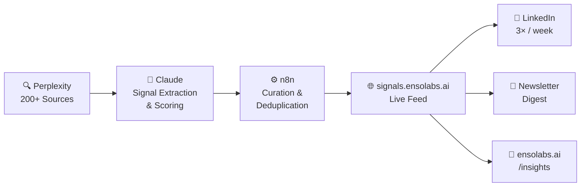

<p align="center">
  
</p>

<h2 align="center">signal2noise</h2>

<p align="center">
  <strong>Autonomous AI signal intelligence engine for marketing strategists, consultants, and content teams.</strong><br/>
  Research → Extraction → Curation → Publishing → Distribution — fully automated, zero manual intervention.
</p>

<p align="center">
  <a href="https://signals.ensolabs.ai"></a>
  
  
  
  
  
  
  
</p>

---

## What is signal2noise?

**signal2noise** is a fully autonomous AI content intelligence and media distribution platform built by [Enso Labs](https://ensolabs.ai). It eliminates the daily research burden for marketing strategists, agency consultants, and AI-forward content teams by running an end-to-end pipeline — from source scanning to published signal cards — with no human in the loop during execution.

The platform processes 200+ sources daily across AI, marketing, enterprise tech, and media. Claude extracts and scores each signal for strategic relevance (1–10). Top signals auto-publish to [signals.ensolabs.ai](https://signals.ensolabs.ai) and distribute to LinkedIn, newsletter, and the ensolabs.ai/insights feed.

> **signal2noise** is the content intelligence layer powering the Enso Labs studio practice — and a live demonstration of agentic AI applied to media and publishing.

---

## Pipeline Architecture



---

## How It Works

| Stage | What Happens |
|-------|-------------|
| **Research** | AI agents query Perplexity across 200+ sources — AI news, marketing intelligence, enterprise tech, regulatory signals |
| **Extraction** | Claude analyzes raw content, extracts key signals, scores strategic relevance 1–10, and writes analyst-grade summaries |
| **Curation** | n8n workflows deduplicate, categorize by topic cluster, and rank by impact score |
| **Publishing** | Top 10–15 signals auto-publish daily to signals.ensolabs.ai as formatted signal cards |
| **Distribution** | Content flows to ensolabs.ai/insights, LinkedIn (3×/week), and the weekly newsletter digest |

---

## Key Features

| Feature | Details |
|---------|---------|
| **Autonomous daily pipeline** | 10–15 curated signals generated per day with zero manual intervention |
| **MCP channel evaluator** | Scores and ranks distribution channels by reach, engagement, and audience fit |
| **Multi-format output** | Signal cards, long-form articles, social posts, newsletter digests — one pipeline, many formats |
| **Claude integration** | Deep integration with Claude API for signal analysis, summarization, and content generation |
| **Perplexity research layer** | Automated, real-time web research queries across curated source clusters |
| **n8n workflow orchestration** | Scheduled automation for pipeline triggers, content routing, and distribution |
| **MCP-enabled** | Model Context Protocol endpoint for AI agent discoverability |
| **GA4 analytics** | Custom event monitoring for signal engagement, click-throughs, and feed interactions |
| **Real-time feed** | Live-updating signal feed embedded on ensolabs.ai — always current |

---

## Tech Stack

| Layer | Technology |
|-------|-----------|
| Frontend | React 18, TypeScript, Custom CSS |
| Backend | Firebase (Hosting, Cloud Functions, Firestore) |
| AI Research | Perplexity API — automated real-time web research |
| AI Intelligence | Claude API (Anthropic) — signal extraction, scoring, summarization |
| Automation | n8n workflows — scheduling, routing, distribution orchestration |
| Discoverability | MCP skill definitions, channel evaluator, structured metadata |
| Analytics | GA4 with custom event tracking |
| Deployment | Firebase Hosting |

---

## Repository Structure

```
signal2noise-engine/
├── app/                        # React application — signal feed, cards, filters
├── backend-integration/        # API connectors + data ingestion pipelines
├── components/                 # UI components (signal cards, feeds, category filters)
├── contexts/                   # React context providers
├── functions/                  # Firebase Cloud Functions — pipeline triggers
├── hooks/                      # Custom React hooks
├── mcp-channel-evaluator/      # MCP-based distribution channel scoring engine
├── n8n/                        # n8n workflow automation configs
├── scripts/                    # Deployment + automation scripts
├── skills/                     # Claude skill definitions (YAML)
├── src/                        # Core application source
├── src-terminal/               # Terminal interface for pipeline monitoring
├── utils/                      # Shared utilities
└── ux/                         # UX research + design artifacts
```

---

## Use Cases

- **Marketing strategists** who need daily signal briefings without the research overhead
- **Agency consultants** building AI-native content practices for clients
- **Content teams** replacing manual curation with an autonomous intelligence layer
- **AI builders** studying agentic pipeline architecture — Claude + Perplexity + n8n + Firebase
- **Studio operators** integrating signal feeds into client-facing deliverables

---

## Powered By

| Tool | Role |
|------|------|
| **Claude (Anthropic)** | Signal analysis, content generation, curation logic, skill definitions |
| **Perplexity** | Automated web research, real-time source discovery |
| **Firebase** | Hosting, serverless Cloud Functions, real-time Firestore database |
| **n8n** | Workflow orchestration — scheduling, routing, and distribution automation |
| **MCP** | Model Context Protocol for AI agent and LLM discoverability |
| **Enso Labs** | Architecture, strategy, and human-in-the-loop quality oversight |

---

## Deploy

```bash
# Install dependencies
npm install

# Start local dev
npm run dev

# Deploy to Firebase
firebase deploy --only hosting
```

> Manual deploy workflow. Not auto-deployed from GitHub push.

---

## Live Product

👉 [signals.ensolabs.ai](https://signals.ensolabs.ai) — live signal feed, updated daily  
📰 [ensolabs.ai/insights](https://ensolabs.ai/insights) — intelligence essays and long-form analysis  
🏢 [ensolabs.ai](https://ensolabs.ai) — Enso Labs studio

---

## License

MIT License. See [LICENSE](LICENSE) for details.

---

<p align="center">
  <strong>Research by Perplexity · Intelligence by Claude · Orchestration by n8n · Platform by Enso Labs</strong><br/>
  <sub>Human-in-the-loop: <a href="https://linkedin.com/in/savbanerjee">Sav Banerjee</a> · NYC</sub>
</p>
