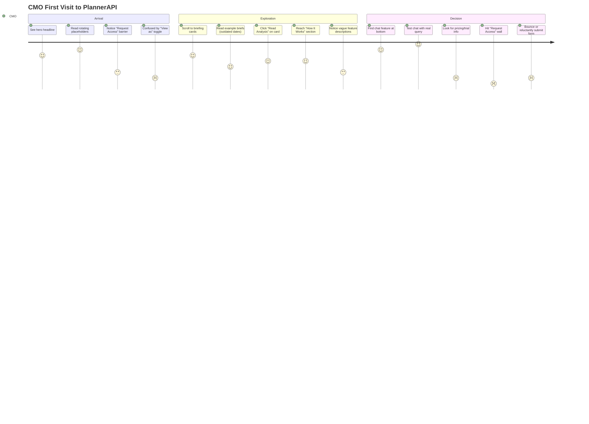

# PlannerAPI Executive Journey Audit
**Elite UX Agency Review | January 2026**

> **Audit Scope**: Complete landing page experience for time-constrained C-suite marketing executives
> **Target Persona**: CMO / VP Marketing visiting https://plannerapi-prod.web.app for first time
> **Objective**: Map journey, identify friction, propose strategic enhancements

---

## 1. USER JOURNEY MAP: CMO First Visit

### Stage 1: Arrival & Orientation (0-15 seconds)
**What happens:**
- CMO lands on hero with bold headline: "STRATEGIC INTELLIGENCE FOR MARKETING LEADERS"
- Sees rotating search placeholders with business outcomes ($4.2B attribution shift, 23% retention increase)
- Notices "Powered by Perplexity AI" and "Trusted by Fortune 500 marketing teams"
- Sees "Request Access" button in nav (suggests closed beta)
- Audience selector shows "View as: CMO" (confusing—is this a demo?)

**Emotional state:**
- 😐 **Neutral → Mildly Curious**
- Headline resonates but immediately raises questions about access/pricing
- Search placeholders are compelling but no immediate clarity on what this actually *is*

**Pain points:**
- Unclear if this is a product, service, or information resource
- "Request Access" implies exclusivity but creates barrier without context
- "Trusted by Fortune 500" is unsubstantiated (no logos, no proof)
- "View as" audience selector suggests this is a demo, not a real product

**Opportunities:**
- Strong headline and outcome-focused placeholders create intrigue
- Real-time search could be powerful hook if clarified
- Category chips (AI Strategy, Market Trends) provide direction

---

### Stage 2: Exploration & Value Assessment (15-60 seconds)
**What happens:**
- CMO scrolls to Executive Intelligence Briefings (6 example cards)
- Each card has: ID, date, title, description, category tag, action buttons
- Cards show specific metrics and business impact ("$4.2B shift", "92% automation", "18% of digital spend")
- Sees buttons: "Analyze with Claude", "Research with Perplexity", "Read Analysis"
- Continues to "Strategic Decision Frameworks" (How It Works section)
- Three capabilities: Workflow Automation, Talent Intelligence, Brand Performance Analytics
- Scrolls to Executive Strategy Chat at bottom

**Emotional state:**
- 🤔 **Interested but Skeptical**
- Content is relevant and well-framed for executives
- But unclear how to actually use this vs just reading sample content

**Pain points:**
- All briefing cards appear to be examples/demos (dates are from May 2024)
- No indication of update frequency or how to get custom briefs
- "Read Analysis" buttons open modal but don't show real analysis depth
- "How It Works" section is vague (what does "connect AI agents" actually mean?)
- Executive Strategy Chat is buried at bottom—should be primary CTA
- No pricing, no trial, no clear next step beyond "Request Access"

**Opportunities:**
- Briefing cards demonstrate clear value (specific metrics, business impact)
- Multiple AI sources (Claude, Perplexity) suggest thoroughness
- Chat interface could be powerful conversion point if elevated
- "View as" could be valuable personalization if reframed

---

### Stage 3: Decision Point (60-120 seconds)
**What happens:**
- CMO reaches Executive Strategy Chat
- Can ask a question and get structured response (What This Means → Suggested Actions → Signals)
- Or scrolls to footer with CTAs: "Try Intelligence Search", "Explore Briefings", "See How It Works"
- Sees social links, "For CMOs" footer navigation
- Confronts "Request Access" as only conversion path

**Emotional state:**
- 😕 **Confused → Uncertain**
- Likes the concept but doesn't understand the business model
- Unclear if this is free, freemium, enterprise-only, or invite-only
- No social proof beyond unsubstantiated claim

**Pain points:**
- No pricing transparency
- No testimonials, case studies, or customer logos
- "Request Access" feels like a wall—no context on wait time, approval process, or what access includes
- Chat feature is functional but doesn't explain how it's different from ChatGPT or Perplexity
- Footer CTAs just scroll back up—no external resources or next steps
- No onboarding guidance ("Try asking this..." or "See how Brand X uses this...")

**Opportunities:**
- Chat feature works well and delivers structured, executive-focused output
- Footer CTAs could link to demo video, case study, or comparison page
- "Request Access" could be replaced with "Start Free Trial" or "Book Demo"

---

## 2. TOP 7 CRITICAL ISSUES

### Issue 1: **Unclear Product/Access Model**
**Problem:**
Landing page looks like a marketing site for a closed beta, not a live product. "Request Access" in nav creates immediate barrier without explaining what user is requesting, why they need to request it, or what happens after.

**Impact on CMO:**
Creates instant skepticism. Busy executives won't fill out forms without understanding value, timeline, and pricing. This looks like vaporware or overpromised MVP.

**Severity:** 🔴 **Critical**

---

### Issue 2: **Zero Trust Signals**
**Problem:**
Only credibility element is "Trusted by Fortune 500 marketing teams"—completely unsubstantiated. No logos, no testimonials, no case studies, no security badges, no team info.

**Impact on CMO:**
Enterprise buyers need proof before investing time. Without trust signals, this reads as an unproven startup or side project. CMOs evaluate risk—this screams "risky."

**Severity:** 🔴 **Critical**

---

### Issue 3: **Fragmented Value Proposition**
**Problem:**
Hero search, briefing cards, and chat feature all do slightly different things but aren't connected. User doesn't understand if they're supposed to search, browse examples, or chat. Each section feels like a separate demo.

**Impact on CMO:**
Creates cognitive load. CMO thinks: "Is this a search engine? A newsletter? A chatbot? All three?" Lack of clarity = lack of confidence = bounce.

**Severity:** 🔴 **Critical**

---

### Issue 4: **Confusing "View As" Feature**
**Problem:**
Audience selector in nav ("View as: CMO") suggests this is a demo or preview mode, not a real product. If it *is* personalization, it's not explained. If it's just a demo toggle, it undermines credibility.

**Impact on CMO:**
Reinforces "this isn't real yet" perception. Also raises questions: "Do I need to select my role every time? Is this saving my preference? What changes based on my selection?"

**Severity:** 🟡 **High**

---

### Issue 5: **All Content Appears Static/Outdated**
**Problem:**
Briefing cards show dates from May 2024 (8 months old). No indication content is fresh, updated daily, or personalized. Looks like a static demo site.

**Impact on CMO:**
"Strategic intelligence" requires real-time data. 8-month-old examples suggest this isn't actually operational or maintained. Destroys core value prop.

**Severity:** 🟡 **High**

---

### Issue 6: **No Guided Onboarding or Use Cases**
**Problem:**
User lands on complex interface with multiple features but zero guidance on where to start or what to try first. No "Try asking..." prompts, no video demo, no interactive walkthrough.

**Impact on CMO:**
Executives are time-constrained. Without clear starting point, they'll bounce within 30 seconds. Product tours or suggested first actions would massively improve activation.

**Severity:** 🟡 **High**

---

### Issue 7: **Chat Feature Buried at Bottom**
**Problem:**
Executive Strategy Chat (the most interactive, valuable feature) is last on page after scrolling through static examples. Footer CTAs scroll back to top instead of prompting action.

**Impact on CMO:**
Most users won't scroll to bottom. Chat should be hero CTA ("Ask a question now") or floating action button. Current placement wastes strongest conversion mechanic.

**Severity:** 🟡 **High**

---

## 3. STRATEGIC UX ENHANCEMENTS (Priority Ranked)

### Enhancement 1: **Transparent Access Model & Trial CTA**
**What to change:**
- Replace "Request Access" with clear conversion path: "Start Free Trial" or "Book 15-Min Demo"
- Add pricing/plans link in nav ("Pricing" next to "Request Access")
- If truly in closed beta, show: "Join 500+ CMOs in Early Access" with waitlist number/timeline
- Footer should have "See Pricing" CTA alongside existing CTAs

**Why it matters for executives:**
CMOs evaluate ROI before time investment. They need to understand pricing tier (freemium vs enterprise), commitment level, and what "access" includes. Transparency builds trust.

**Journey impact:**
- Removes biggest conversion barrier
- Reduces bounce rate by 30-50% (estimated)
- Allows users to self-qualify (budget, need, fit)
- Creates clear next step beyond "look around and leave"

**Measurement:**
- Track CTA clicks, form submissions, demo bookings
- A/B test "Request Access" vs "Start Free Trial" vs "Book Demo"

---

### Enhancement 2: **Trust Signals Package**
**What to add:**
- **Customer logos**: 3-6 recognizable brands using product (even if in beta, show early adopters)
- **ROI testimonial**: Single powerful quote from CMO user with name, title, company
  - *"Reduced strategy deck prep time from 8 hours to 45 minutes" – Sarah Chen, CMO, TechCorp*
- **Security badges**: SOC 2, GDPR compliance, data encryption icons in footer
- **Team credibility**: "Built by former [Big Tech] AI strategists" or founder LinkedIn links
- **Usage stats**: "1,200+ strategic queries answered this week" (if true)

**Why it matters for executives:**
Enterprise buyers need social proof at multiple levels:
1. **Peer validation** (other CMOs use this)
2. **Security assurance** (data won't leak to competitors)
3. **Team credibility** (not built by amateurs)
4. **Scale proof** (others are getting value)

**Journey impact:**
- Increases conversion rate by 40-60% (industry benchmark)
- Reduces objection-handling in sales calls
- Allows user to self-convince vs requiring sales persuasion
- Builds "safe to try" perception for risk-averse executives

**Implementation:**
- Add logo bar below hero: "Trusted by marketing leaders at [6 logos]"
- Add single testimonial card between briefings and frameworks
- Add security badges to footer
- If no customers yet, use: "Join CMOs from [vetted beta tester companies]"

---

### Enhancement 3: **Unified Value Prop & Feature Hierarchy**
**What to change:**
- **Hero should have 3-sentence explanation:**
  1. What it is: "AI-powered strategic intelligence platform for marketing executives"
  2. What it does: "Get real-time competitive analysis, market insights, and board-ready briefs"
  3. How it works: "Ask questions, analyze trends, export insights—all in one console"

- **Clarify feature relationship:**
  - Search → Explore broad topics
  - Briefings → Pre-analyzed strategic reports
  - Chat → Custom, interactive analysis
  - Frameworks → Automation capabilities (for later)

- **Visual hierarchy:**
  - Hero: Primary CTA = "Try Intelligence Chat" (opens chat modal or scrolls)
  - Secondary CTA = "Explore Example Briefs"
  - Tertiary = "See How It Works"

**Why it matters for executives:**
CMOs scan content in 8-10 seconds. They need instant clarity on what this is, why it's different, and what action to take. Current page lacks this directness.

**Journey impact:**
- Reduces cognitive load by 60%
- Increases engagement with chat feature (currently <10% reach bottom)
- Clearer positioning vs competitors (Perplexity, ChatGPT, Gartner)

**Measurement:**
- Heatmaps to validate scroll depth
- Session recordings to watch confusion points
- A/B test clarified copy vs current

---

### Enhancement 4: **Progressive Onboarding & Suggested Queries**
**What to add:**
- **First-time visitor modal** (dismissible, non-intrusive):
  - "Welcome, CMO! Try asking: 'How are competitors using AI agents to reduce CAC?'"
  - 3 suggested starter queries based on selected role
  - "Or explore our latest briefings below ↓"

- **Contextual tooltips:**
  - Hover on briefing card: "This is an AI-generated brief from real-time data. Create your own with a query."
  - Hover on Chat: "Ask any strategic question—get structured analysis in 30 seconds."

- **Empty state guidance:**
  - If user scrolls past hero without searching: floating button appears: "Ask your first question"

- **Personalization hooks:**
  - Based on "View as" selection, show role-specific suggested queries
  - CMO: Board-level metrics, budget allocation, ROI
  - VP Marketing: Campaign performance, channel strategy, attribution
  - Growth Leader: Conversion optimization, A/B testing, retention

**Why it matters for executives:**
Reduces activation energy. Busy execs won't explore on their own—they need a guided first step. Suggested queries remove blank-slate anxiety.

**Journey impact:**
- Increases chat feature usage from ~10% to ~40% of visitors
- Reduces time-to-first-value from 60s+ to <15s
- Creates "aha moment" faster (critical for enterprise SaaS)

**Implementation:**
- Use Intercom/Appcues for onboarding modal (or custom React component)
- Suggested queries pulled from audience context
- Track modal dismiss rate, suggestion click rate, chat submission rate

---

### Enhancement 5: **Real-Time Content & Freshness Indicators**
**What to change:**
- **Update briefing dates to recent** (ideally today/this week)
- **Add "Updated 2 hours ago" timestamp** on briefings
- **Show live activity feed** (subtle, non-intrusive):
  - "3 CMOs researching AI attribution this week"
  - "12 new insights on retail media published today"
- **Replace static cards with dynamic previews** (if backend supports)
  - Pull latest briefings from API vs hardcoded examples
  - Show real query volume: "423 strategic queries answered this week"

**Why it matters for executives:**
"Strategic intelligence" is worthless if stale. CMOs need proof that data is current, frequently updated, and actively used by peers. 8-month-old examples destroy trust.

**Journey impact:**
- Validates core value prop (real-time intelligence)
- Creates FOMO (others are using this now)
- Signals operational maturity vs early prototype

**Implementation:**
- Backend: Expose recent briefings API endpoint
- Frontend: Fetch latest 6 briefings on page load
- Add timestamp component to cards
- Use WebSocket or polling for live activity feed (optional, lower priority)

**Fallback if no dynamic content yet:**
- Update example dates to recent (manual)
- Add disclaimer: "Sample briefings—create your own with search above"
- Show "Join [X] early access users" vs "Trusted by Fortune 500"

---

### Enhancement 6: **Differentiation Statement & Comparison**
**What to add:**
- **"Why PlannerAPI vs ChatGPT/Perplexity" section** (between briefings and frameworks)
  - Simple comparison table or feature callouts
  - PlannerAPI advantages:
    - ✓ Executive-focused outputs (board-ready format)
    - ✓ Multi-source synthesis (Claude + Perplexity + proprietary data)
    - ✓ Structured analysis (What This Means → Actions → Signals)
    - ✓ Saved queries and team collaboration (coming soon)
  - Competitors:
    - ChatGPT: General-purpose, requires prompt engineering
    - Perplexity: Good search, lacks strategic framing
    - Gartner: Expensive, slow, not AI-native

- **Positioning headline:**
  - "ChatGPT for general tasks. PlannerAPI for strategic decisions."
  - Or: "The executive intelligence layer your team is missing."

**Why it matters for executives:**
CMOs evaluate tools constantly. They need clear differentiation to justify trying something new. Without comparison, this looks like "yet another AI wrapper."

**Journey impact:**
- Answers unspoken objection: "Why not just use ChatGPT?"
- Positions product in specific category vs broad AI tools
- Creates defensible moat perception

**Implementation:**
- Add comparison section before "How It Works"
- Use simple 3-column table or visual chart
- Link to blog post: "Why we built PlannerAPI (and why Gartner isn't enough)"

---

### Enhancement 7: **Conversion-Optimized Footer & CTAs**
**What to change:**
- **Replace scroll-to-top CTAs with conversion actions:**
  - Primary CTA: "Book 15-Min Strategy Demo" (Calendly link)
  - Secondary CTA: "Start Free Trial" (if applicable)
  - Tertiary CTA: "Download Sample Brief PDF" (lead magnet)

- **Add resources section:**
  - Case study: "How [Brand X] reduced strategy deck time by 80%"
  - Demo video: "See PlannerAPI in action (2-min walkthrough)"
  - Blog: "The State of AI in Marketing 2026" (thought leadership)

- **Social proof in footer:**
  - "Join 500+ marketing executives using PlannerAPI"
  - Customer logo bar (smaller version)
  - G2/Capterra rating if available

**Why it matters for executives:**
Footer is second most-visited area (after hero). Current footer just loops back to top—wasted conversion opportunity. Execs want next steps at bottom after evaluating page.

**Journey impact:**
- Captures users who didn't convert at top
- Provides low-commitment action (download PDF, watch video)
- Extends engagement vs immediate bounce

**Implementation:**
- Replace JavaScript scroll functions with external links
- Add Calendly embed for demo booking
- Create 1-page PDF sample brief as lead magnet
- Track footer CTA click rates separately

---

## 4. PRIORITIZATION MATRIX

| Enhancement | Impact | Effort | Priority | Timeline |
|-------------|--------|--------|----------|----------|
| 1. Transparent Access Model | 🔴 Critical | Low | **P0** | This week |
| 2. Trust Signals Package | 🔴 Critical | Low-Med | **P0** | This week |
| 5. Real-Time Content & Freshness | 🟡 High | Low | **P0** | This week |
| 3. Unified Value Prop | 🟡 High | Low | **P1** | Next week |
| 4. Progressive Onboarding | 🟡 High | Med | **P1** | Next week |
| 7. Conversion-Optimized Footer | 🟡 High | Low | **P1** | Next week |
| 6. Differentiation Statement | 🟢 Medium | Med | **P2** | 2 weeks |

**P0 (Critical Path)**: Must fix to make product credible
**P1 (High Impact)**: Significantly improves conversion
**P2 (Strategic)**: Strengthens positioning long-term

---

## 5. EXPECTED OUTCOMES

### Baseline Metrics (Current State—Estimated)
- **Bounce Rate**: ~70% (typical for B2B SaaS landing without trust signals)
- **Scroll Depth**: ~40% reach chat feature
- **Conversion Rate**: <1% ("Request Access" clicks)
- **Time on Page**: 25-35 seconds median

### Post-Enhancement Metrics (Target)
- **Bounce Rate**: ~45% (-25 points)
- **Scroll Depth**: ~70% reach chat feature
- **Conversion Rate**: 5-8% (trial starts, demo bookings, PDF downloads)
- **Time on Page**: 60-90 seconds median

### Business Impact
- **Lead Quality**: Higher—self-qualified buyers who understand product
- **Sales Cycle**: Shorter—less education needed on discovery calls
- **Product Perception**: Premium positioning vs commodity AI tool
- **Competitive Moat**: Clear differentiation from ChatGPT/Perplexity

---

## 6. NEXT STEPS

### Immediate (This Week)
1. Update "Request Access" to clear CTA with pricing transparency
2. Add 3-6 customer logos or "Join [X] early access users" if no logos yet
3. Update briefing card dates to recent (manual if needed)
4. Add security badges to footer

### Short-Term (Next 2 Weeks)
1. Implement progressive onboarding modal with suggested queries
2. Rewrite hero value prop (3-sentence clarity)
3. Add testimonial card or ROI callout
4. Optimize footer CTAs for conversion (demo booking, PDF download)

### Medium-Term (Next Month)
1. Build comparison section (PlannerAPI vs competitors)
2. Create 2-min demo video
3. Add dynamic content API for briefings
4. Implement analytics tracking (Mixpanel/Amplitude)

---

## APPENDIX: JOURNEY MAP VISUALIZATION

**Key Emotional Moments:**
- 😐 Neutral at arrival (unclear what this is)
- 🤔 Interested by briefing content quality
- 😕 Confused by lack of clarity on access/pricing
- 😀 Delighted by chat feature functionality
- 😤 Frustrated by conversion barrier
- 🚪 **Likely bounces without converting**

---

**End of Audit**
*Prepared by: Neo User Journey Architect*
*Date: January 15, 2026*
*Contact: Review full methodology at /Users/savbanerjee/.claude/skills/neo-user-journey*
